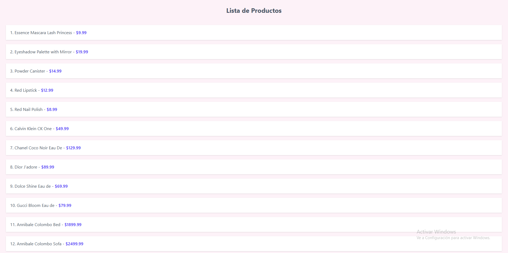

# Evidencia 1

Para esta evidencia se utilizo un simple diseño de lista que muestra los productos. Para la siguiente evidencia se mejoró utilizando cards y dividiendo los componentes.

## Instrucciones para ejecutar el proyecto.

Este proyecto fue desarrollado con **React** usando **Vite**, **Tailwind CSS** y **Axios**. Se debe tener instalado **Node.js**.

- 1. Clonar el repositorio
- 2. npm install
- 3. npm run dev.

## Imagen

