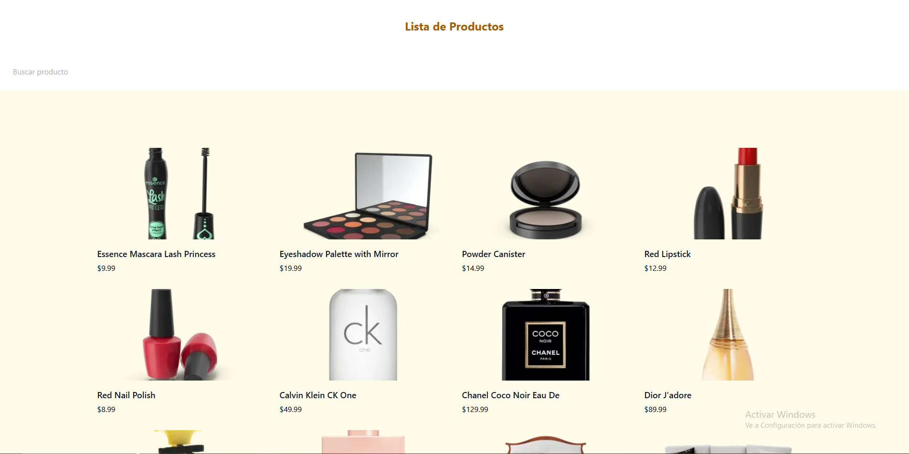
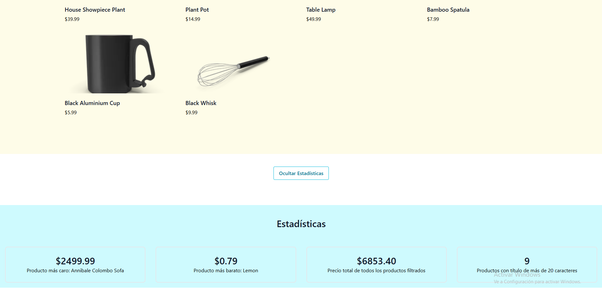

# Evidencia 2

## Estadísticas

Se agregaron 4 estadísticas, estas son:

- Mostrar el título del producto más caro.
- Muestrar el título del producto más barato.
- Calcular el precio total.
- Mostrar los productos que tengan en su título más de 20 caracteres.

## Componentes

Se mejoró la organización del código y se crearon los componentes:

- ProductsList: Utiliza el diseño de una card de Ecommerce de Tailblocks y muestra la lista de productos.
- StatsPanel: Utiliza el diseño de una card de Stats de Tailblocks y muestra las nuevas estadísticas.

  Ambas cuentan con las props necesarias para funcionar y no contienen lógica de estado interno.

## Imagen

